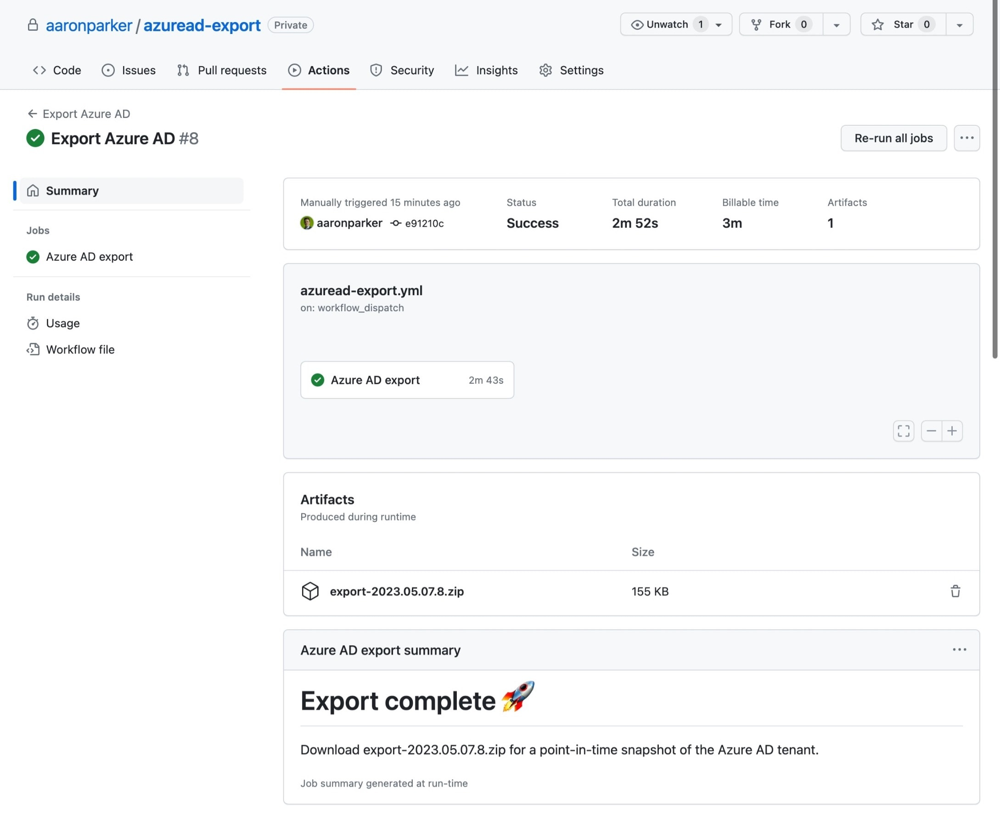
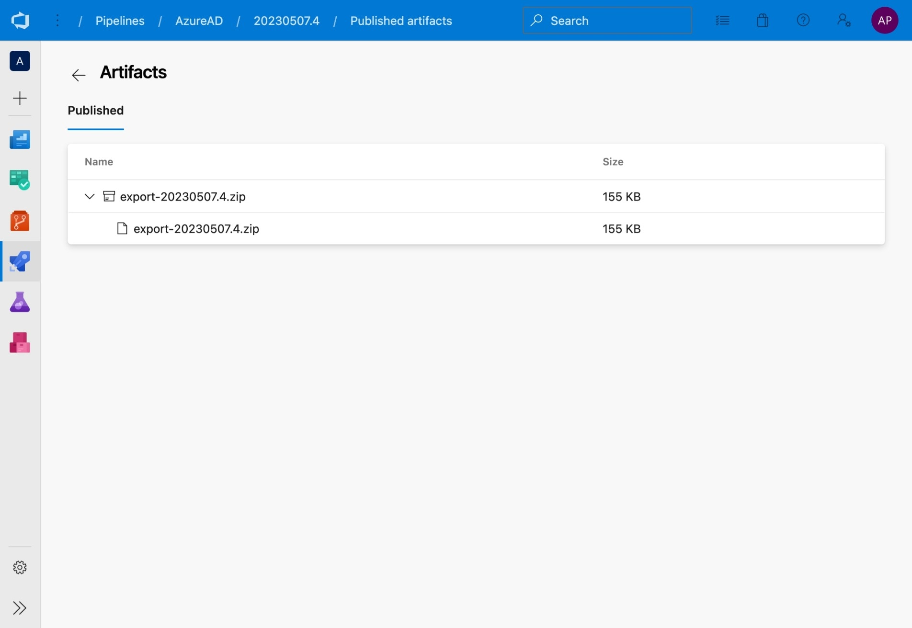

# Azure AD Export

A template repo using the [AzureADExporter](https://github.com/microsoft/azureadexporter) PowerShell module to export Azure AD tenant settings.

* [.github/workflows/azuread-export.yml](.github/workflows/azuread-export.yml) - a GitHub workflow to connect to Azure AD, export settings and commit to the repository. Use this if you want to run the workflow in GitHub
* [.devops/azuread-export.yml](.devops/azuread-export.yml) - an Azure Pipeline to connect to Azure AD, export settings and commit to the repository. Use this if you want to run the pipeline in an Azure DevOps project
* [Export-AzureAD.ps1](Export-AzureAD.ps1) - a PowerShell script to run the export locally. Expects a `auth.json` file that contains the authentication values

## Workflow / Pipeline Secrets

Workflows expect the following secrets to be available in the repository:

* `TENANT_ID` - tenant identifier (GUID) of the target Azure AD tenant
* `CLIENT_ID` - client identifier (GUID) of the Azure AD app registration
* `CLIENT_SECRET` - client secret to authenticate to the app registration
* `COMMIT_NAME` - Display name of the commit details
* `COMMIT_EMAIL` - email address of the commit details
* `GPGKEY` - GPG key for signing commits (used by the GitHub workflow)
* `GPGPASSPHRASE` - GPG passphrase

## Auth.json

When running the `Export-AzureAD.ps1` script, ensure `auth.json` exists locally with credentials for connecting to an Azure AD app registration in the target tenant.

```json
{
    "Tenant_Id": "9a3ceddc-3faa-42e1-841b-4fc7d3c57c19",
    "Client_Id": "19ab2050-1bf2-4e97-8b69-0e1a4543bc4e",
    "Secret": "<secret>",
}
```

## Permissions

The following permissions on an Azure AD app registration are required to enable an unattended export via a pipeline:

|API / Permissions name|Type|Description|
|:----|:----|:----|
|AccessReview.Read.All|Application|Read all access reviews|
|AdministrativeUnit.Read.All|Application|Read all administrative units|
|Agreement.Read.All|Application|Read all terms of use agreements|
|APIConnectors.Read.All|Application|Read API connectors for authentication flows|
|Directory.Read.All|Application|Read directory data|
|EntitlementManagement.Read.All|Application|Read all entitlement management resources|
|Group.Read.All|Application|Read all groups|
|GroupMember.Read.All|Application|Read all group memberships|
|IdentityProvider.Read.All|Application|Read identity providers|
|IdentityUserFlow.Read.All|Application|Read all identity user flows|
|Organization.Read.All|Application|Read organization information|
|Policy.Read.All|Application|Read your organization's policies|
|Policy.Read.PermissionGrant|Application|Read consent and permission grant policies|
|PrivilegedAccess.Read.AzureAD|Application|Read privileged access to Azure AD roles|
|PrivilegedAccess.Read.AzureResources|Application|Read privileged access to Azure resources|
|RoleManagement.Read.Directory|Application|Read all directory RBAC settings|
|User.Read|Delegated|Sign in and read user profile|
|User.Read.All|Application|Read all users' full profiles|
|UserAuthenticationMethod.Read.All|Application|Read all users' authentication methods|

## Outputs

Each workflow / pipeline will export Azure AD settings from the target tenant and save the export into the `export` folder, and attach a zip file of the export to the pipeline artifacts.

**GitHub**:



**Azure DevOps**:


